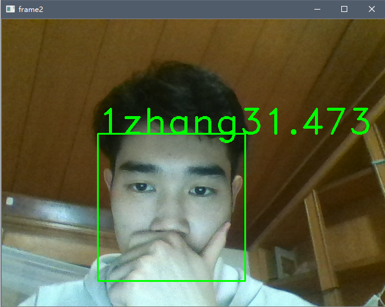

# faceRecognitonDemo  

目录介绍


```
  .|
   |- spyproject      //spyder 项目文件夹
   |
   |
   |- README.asserts   //README.md 图片文件
   |
   |- src               //源文件
   |    |-Classfier.py
   |    |-loopMain.py
   |
   |- README.md
   |
```


## 1.功能描述

​      本项目使用python  opencv 库，调用摄像头，并使用 cv2.data.haarcascades 的相关配置文件，进行人脸的检测与识别。

​      该项目可以实时通过摄像头获取人脸图像，并实时框选人脸，显示其名字，以及预测的置信度。可同时识别多人。

​     通过检测相应的按键，可通过摄像头保存截取的图片，并以文件形式保存到 相应的文件夹。

​      通过按键，可以添加，删除人物的图像文件，进行训练模型。


声明：此项目文档主要是写给自己看的，源代码也是几个月前写的，现在要写实验报告才总结一下的（学生苦啊）

​           如果你遇到了问题来问我  还不如你自己想办法解决[doge]，因为我也可能帮不了你多少

2020/6/6


## 2.开发环境

python 3.x


所需的库依赖

### 1.os

因为涉及到文件的操作，（保存，删除已有的图片记录；训练模型需要读入数据），系统自带，不用安装


### 2.cv2

需要以下2个库文件

pip install opencv-python

pip install opencv-contrib-python


### 3.numpy

cv2 中的相关模型要求数据（图像）是numpy 类型的，这要才可以训练以及预测。


## 3.项目结构


### 1.源文件结构

包含2个源文件代码

```
loopMain.py
Classifier.py
```


Classifier.py 进行初始化操作，训练模型，检测按键，文件操作，被loopMain.py 调用

直接运行loopMain.py 就可以调用摄像头，运行程序，进入一个死循环，直到用户按键退出或者运行错误退出。


### 2.数据文件结构

dir_path 是自己提供的一个已经存在的空目录

​    第一次运行的时候会自动创建  文件夹img， config.txt

​    每次添加人物的时候，会在img文件夹下创建子文件夹，并创建P1 (你输入的的名字)子文件夹，并截取10张图像进行存储

​    config.txt 前期主要是想保存一下相关的配置信息，（已有的人名，打包训练的模型），后期发现用不着，就没有进行操作。训练很快，不用打包训练模型；如果使用机器学习算法训练模型，就不能便捷地添加，删除人物，重新训练。


     dir_path |
              |- img
              |    |-- P1     
              |    |    | p1_0.png
              |    |    | p1_1.png
              |    |    | ...
              |    |  
              |    |-- P2
              |    |   | p2_0.png
              |    |   | p2_1.png
              |    |   | ...
              |    |
              |    |-- P3
              |
              |             
              |- config.txt
              |- ...


## 4.结果演示


源文件放在了桌面的 /faceRecognitionDemo/src

数据文件夹放在，e:/AI_face_recognition_demo


按键操作：

a:  add, 添加任务，截取图片

d:  delete,  删除某个人的记录

t:   train 训练

q:  quit  退出


第一次运行时，会自动创建相应的文件夹


每次启动的时候，都会自动检测 img 文件夹是否有数据，如果有，就会自行训练，训练时间极短。

退出后重新启动，就可以识别了


此时，已有了一个人物的数据，可以直接train，然后也可以识别





## 5.BUG & ERROR

### 项目的不足之处


如果某个人物已经参加了训练，然后被delete 掉了，这样会立马报错。

这时候就要重新启动，然后没有问题了,因为每次重新启动都会进行训练（如果有数据的话）。


这是因为摄像头会实时检测人脸，并与已有的数据比对，虽然已训练的模型中有相应的数据，但是名字，图像都被删除了，会造成错误

可以在delete() 函数的最后加上：清空当前的模型，重新读入img 文件夹下的数据，重新训练，但我不想改，就这样吧


尽量不要用delete函数（即按键 't'） 删除记录，可以在程序运行结束后在文件夹中进行删除。下次启动的时候就会重新读入数据训练，这也就是

```python
class Classifier(object):
    def __init__(self, dir_path, modified)：
```

为什要在Classfier 中要指明是不是自己 修改过文件夹。虽然后期 modified 也没有用到，所以就设置成

modified = False 吧


### 常见 ERROR

1.AttributeError: module 'cv2.cv2' has no attribute 'face'

```
pip install opencv-python
pip install opencv-contrib-python
```

多半是这2个库文件出了问题，重装一下这2个库


2.error: OpenCV(4.2.0) C:\projects\opencv-python\opencv\modules\core\src\matrix.cpp:235: error: (-215:Assertion failed) s >= 0 in function 'cv::setSize'

有文件夹，没有训练数据：

​        检查一下img 文件夹下的每个子文件是否有数据

或者删掉img 文件夹


## 6.使用建议

1.尽量不要用delete函数（即按键 't'） 删除记录，可以在程序运行结束后在文件夹中进行删除。下次启动的时候就会重新读入数据训练，这也就是

2.add()  时，保证屏幕中只能有一个人

3.如果按键没有响应的话，就先用鼠标点击一下屏幕，再重新按键